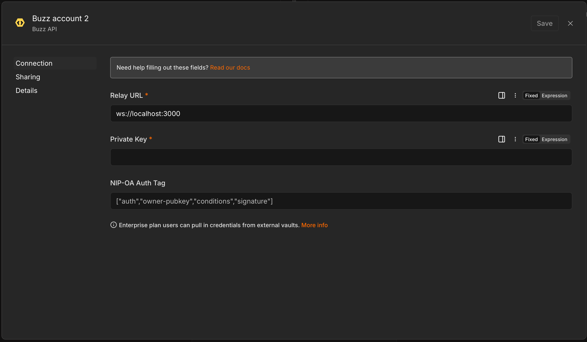
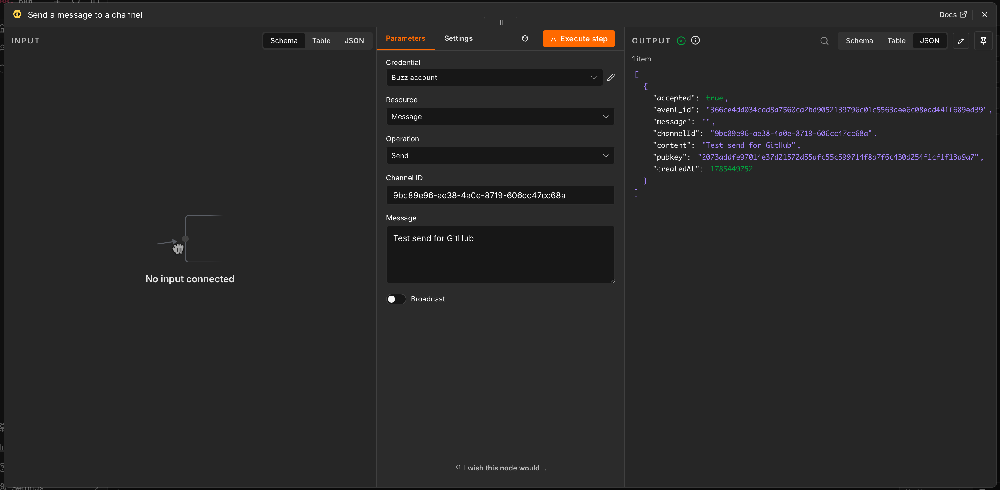
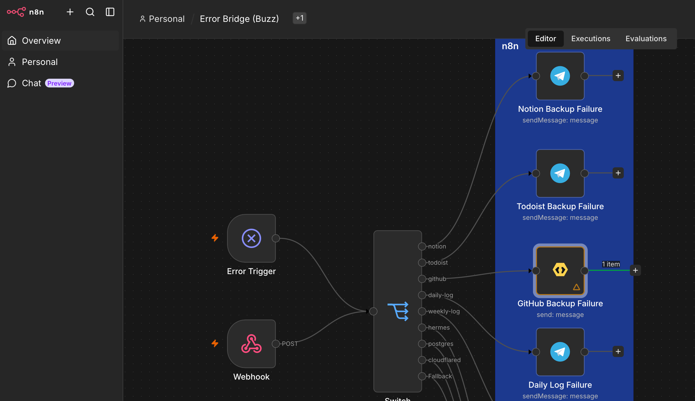

# n8n-buzz

[](https://www.npmjs.com/package/n8n-nodes-buzz)
[](https://github.com/AutonomousWork/n8n-buzz/actions/workflows/ci.yml)
[](LICENSE.md)

Send signed messages from self-hosted [n8n](https://n8n.io/) workflows directly to [Buzz](https://github.com/block/buzz) channels.

Use it for alerts, summaries, job results, and context that people or agents should see and act on. It is a focused replacement for Telegram notification steps: connect a Buzz identity, choose a channel, and send Markdown-capable text from any n8n workflow.

> [!NOTE]
> This is an unofficial community integration maintained by [Autonomous Work](https://github.com/AutonomousWork). It currently supports self-hosted n8n and sends messages only.

<!-- Add the launch video when ready:
## Demo

[Watch the demo video](PASTE_GITHUB_VIDEO_URL_HERE)
-->

## What it does

- Sends a signed text or Markdown message to a Buzz channel UUID
- Accepts expressions and processes one message per incoming n8n item
- Works as a normal output node or as a tool connected to an n8n AI Agent
- Accepts `http(s)` and `ws(s)` Buzz relay URLs
- Signs Buzz/Nostr kind `9` events locally with NIP-98 request authentication
- Supports ordinary member identities and optional NIP-OA delegated-agent authentication
- Can add Buzz's optional `broadcast` tag

The private key remains inside n8n's credential store and is used locally for signing. It is never included in the message or node output.

## Quick start

### Requirements

- A self-hosted n8n instance where you can install community nodes
- A reachable Buzz relay
- A Buzz channel UUID
- Permission to add a member to that channel

### 1. Install the node

In n8n, open **Settings → Community Nodes → Install**, enter the package name, and confirm the installation:

```text
n8n-nodes-buzz
```

Reload the editor if **Buzz** does not immediately appear in the node picker.

For queue mode, private registries, or installations without the Community Nodes screen, follow the [manual and Docker installation guide](docs/manual-install.md).

### 2. Create a Buzz identity for n8n

Use a dedicated service identity instead of a personal or managed-agent identity. If your Buzz relay runs in Docker:

```bash
export BUZZ_RELAY_CONTAINER='buzz-relay-container-name'
docker exec "$BUZZ_RELAY_CONTAINER" buzz-admin generate-key
```

Save both values printed by the command:

- **Public key:** used to grant relay and channel membership
- **Secret key:** entered only in the n8n credential

The secret key is shown once and cannot be recovered. Save it in a password manager, then securely load it as `BUZZ_N8N_PRIVATE_KEY` for the profile step below. The complete [Buzz identity guide](docs/identity.md) covers closed relays, managed agents, profiles, key rotation, and NIP-OA authentication.

### 3. Add the identity to the destination channel

Set the public relay URL and generated public key. Securely load an existing channel owner or administrator's private key as `BUZZ_CHANNEL_ADMIN_PRIVATE_KEY`:

```bash
export BUZZ_RELAY_URL='wss://buzz.example.com'
export BUZZ_N8N_PUBKEY='replace-with-64-character-public-key'

BUZZ_PRIVATE_KEY="$BUZZ_CHANNEL_ADMIN_PRIVATE_KEY" \
  buzz channels add-member \
  --channel 'replace-with-channel-uuid' \
  --pubkey "$BUZZ_N8N_PUBKEY" \
  --role member
```

The owner/admin key authorizes the membership change; it is not the new service key. Repeat this for every channel the workflow should be able to message. Closed Buzz relays may also require the public key in the relay membership roster; see the [identity guide](docs/identity.md#2-add-the-public-key-to-a-closed-relay).

### 4. Give the service identity a friendly name

Buzz shows an unnamed identity as a truncated public key. Publish a profile using the **service identity's** private key:

```bash
unset BUZZ_AUTH_TAG
BUZZ_PRIVATE_KEY="$BUZZ_N8N_PRIVATE_KEY" \
  buzz users set-profile \
  --name 'n8n Notifications' \
  --about 'Automated notifications from n8n'
```

Refresh Buzz after publishing the profile. See the [identity guide](docs/identity.md#4-publish-a-recognizable-profile) for verification, avatars, and troubleshooting.

### 5. Add the Buzz credential in n8n

Create a **Buzz API** credential:

| Field           | Value                                                             |
| --------------- | ----------------------------------------------------------------- |
| Relay URL       | Your Buzz relay's `https://`, `http://`, `wss://`, or `ws://` URL |
| Private Key     | The generated secret key as 64-character hex or `nsec1…`          |
| NIP-OA Auth Tag | Leave empty for the recommended standalone identity               |



_Configure the relay URL and dedicated service identity in an n8n Buzz API credential._

Select **Test credential**. The test makes a signed, read-only profile query and does not post a message.

### 6. Send a message

1. Add a **Buzz** node to a workflow.
2. Select the credential from step 5.
3. Enter the destination channel UUID.
4. Enter a static message or an expression such as `{{ $json.message }}`.
5. Execute the node.

A successful execution returns `accepted: true`, an `event_id`, the channel ID, content, sender public key, and event timestamp.



_The Buzz node signs and sends the message, then returns the relay receipt in the n8n output panel._

## Node fields

| Field      | Required | Description                                     |
| ---------- | -------- | ----------------------------------------------- |
| Channel ID | Yes      | Buzz channel UUID, not the channel display name |
| Message    | Yes      | Text or Markdown, up to 64 KiB                  |
| Broadcast  | No       | Adds `['broadcast', '1']` to the signed event   |

## Replacing a Telegram notification

Replace the Telegram **Send Message** node with **Buzz**, keep the existing message expression, and replace the Telegram chat ID with the Buzz channel UUID. Upstream workflow steps do not need to change.



_Migrate notification routes one at a time while keeping the rest of the workflow unchanged._

## Troubleshooting

- **Unable to authenticate:** Confirm the credential contains the secret/private key, not the public key. Confirm the relay URL and leave the NIP-OA field empty for a standalone identity.
- **Credential test succeeds but sending fails:** The identity can reach the relay but probably is not a member of the destination channel.
- **Relay access is denied:** A closed relay operator must add the identity's public key to the relay membership roster.
- **Sender appears as a public key:** Publish the service identity profile in quick-start step 4, verify it with `buzz users get`, and refresh Buzz.
- **CLI says no community is configured for this host:** Use the public community/relay URL instead of a raw Docker port or unrecognized hostname.
- **Managed agent authentication fails:** The private key and `BUZZ_AUTH_TAG` must belong to the same agent, and the relay must allow NIP-OA authentication.
- **Buzz is missing from the node picker:** Confirm the package appears under **Settings → Community Nodes**, restart n8n, and reload the editor.
- **Only some executions recognize Buzz:** Install the same package version on the n8n main process and every queue worker.

More installation failures and upgrade instructions are in the [manual installation guide](docs/manual-install.md).

## Current scope

This release is intentionally small:

- Self-hosted n8n only; it is not currently a verified n8n Cloud node
- Send message only; there is no Buzz trigger or message reader
- Text and Markdown only; there are no file attachments or reactions

## Protocol

The node follows Buzz's current message write path:

- Nostr event kind `9`
- channel tag `['h', '<channel-uuid>']`
- per-send `['n8n', '<uuid>']` tag so identical same-second notifications remain distinct
- NIP-98 authenticated `POST <relay>/events`
- maximum message size of 64 KiB

The Nostr signing implementation is bundled into the published package. The `buzz` CLI is not required inside the n8n container.

## Documentation

- [Create and authorize a Buzz identity](docs/identity.md)
- [Manual, Docker, queue-mode, upgrade, and uninstall instructions](docs/manual-install.md)
- [Security policy and private-key handling](SECURITY.md)
- [Contributing and local development](CONTRIBUTING.md)
- [Release history](CHANGELOG.md)

## Support

Use [GitHub Issues](https://github.com/AutonomousWork/n8n-buzz/issues) for bugs and focused feature requests. Report suspected vulnerabilities privately through the process in [SECURITY.md](SECURITY.md).

## Development

Requires Node.js 22 or newer:

```bash
npm ci
npm test
npm run lint
npm run build
```

See [CONTRIBUTING.md](CONTRIBUTING.md) before opening a pull request.

## License

[MIT](LICENSE.md)
